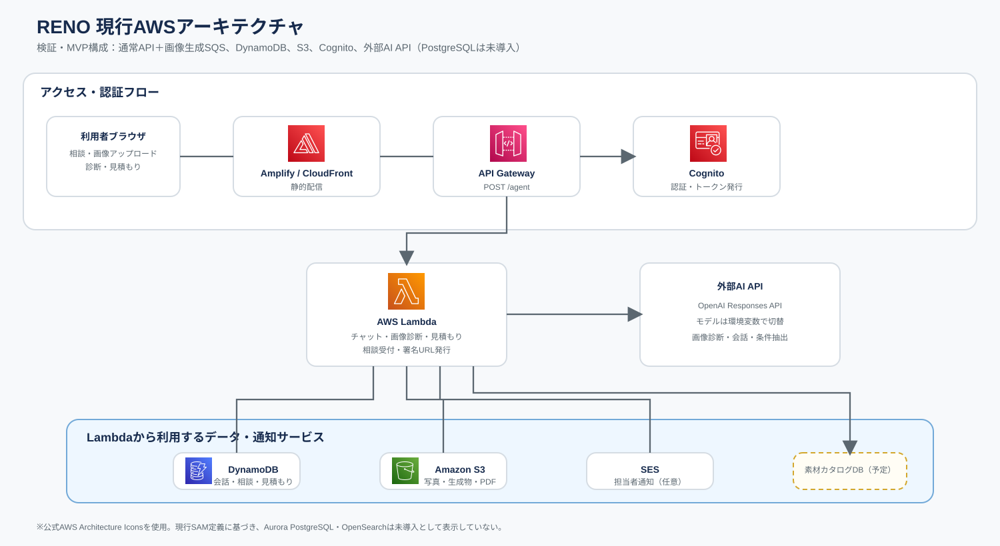

# RENO 現行AWSアーキテクチャ

現行の `backend/template.yaml` および検証環境を基準にした構成図です。

## 現行構成

| サービス | 現在の役割 |
|---|---|
| Amplify / CloudFront | 静的フロントエンド配信 |
| API Gateway | `POST /agent` のAPI入口 |
| Lambda | チャット、画像診断、見積もり、相談受付 |
| Cognito | 管理者・利用者の認証、トークン発行 |
| DynamoDB | 会話履歴、相談、見積もり、利用状態 |
| S3 | 写真、生成画像、PDFの保存 |
| SES | 担当者へのメール通知（設定時） |
| 外部AI API | OpenAI Responses APIによる会話・画像診断 |

## 現時点で未導入のもの

- SQSなどの非同期ジョブ基盤（現在は同期処理）
- PostgreSQL／Aurora（素材カタログDBは導入予定）
- OpenSearch等の全文・ベクトル検索基盤
- EventBridgeなどの業務イベント連携

素材カタログDBを導入する場合は、まずDynamoDBまたは検証用SQLiteで開始し、要件が固まった段階でPostgreSQL等への移行を判断します。
