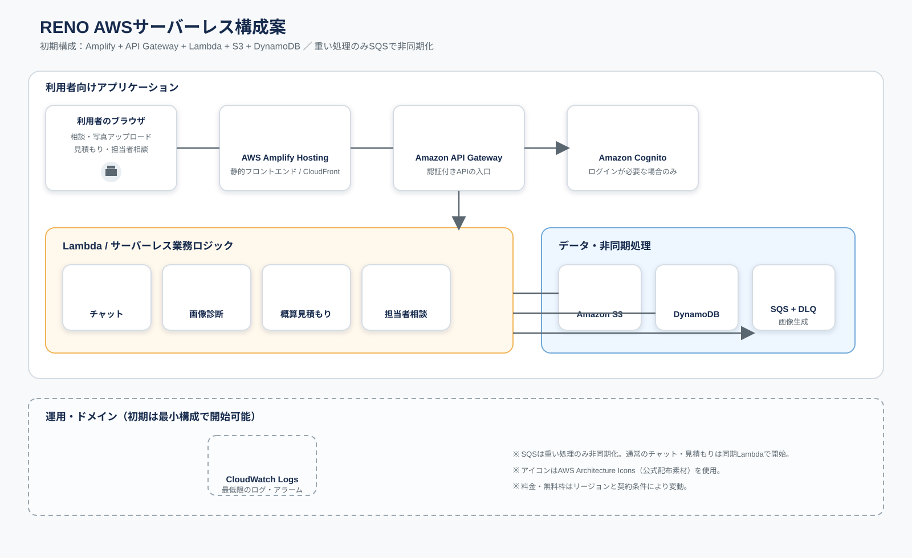
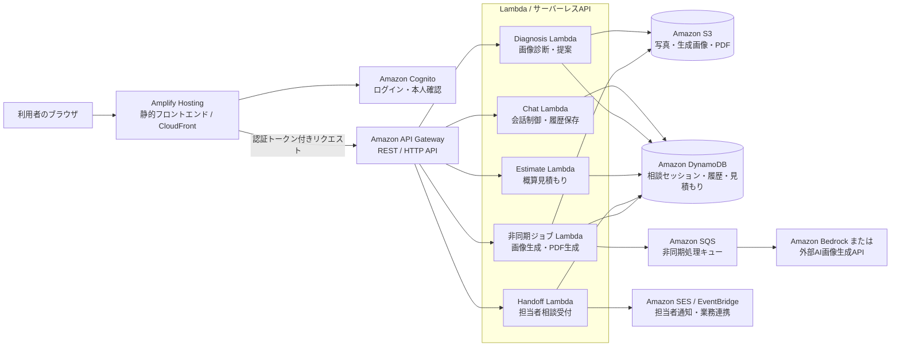

# AWS実サイト構成案（たたき台）

現行モックを実サイトへ移行する場合の、Amplify Hosting＋Lambdaベースの構成イメージです。
この資料は実装前の設計たたき台であり、モックの動作や構成は変更しません。

公式AWSアーキテクチャアイコン版の図はこちらです。

## 主な責務

| レイヤー | AWSサービス | 役割 |
| --- | --- | --- |
| フロントエンド | Amplify Hosting | `index.html` と `assets/` の配信、CI/CD、CloudFront連携 |
| 認証 | Amazon Cognito | 利用者・担当者のログイン、トークン発行 |
| API | API Gateway | ブラウザからLambdaへの入口、認証・レート制限 |
| 業務ロジック | Lambda | チャット、画像診断、見積もり、相談受付 |
| ファイル | Amazon S3 | アップロード写真、生成画像、PDFの保存 |
| データ | DynamoDB | セッション、会話履歴、見積もり、相談受付状態 |
| 非同期処理 | SQS + Lambda | 画像生成やPDF生成の待ち時間を画面から分離 |
| AI | Bedrock / 外部AI API | 会話応答、画像診断、イメージ生成 |
| 通知 | SES / EventBridge | 担当者へのメール通知や将来のCRM連携 |

## モックからの対応関係

- 現在のローカルAIモック → Chat Lambda
- 写真アップロード → S3の署名付きURL
- 画像診断・画像生成 → Diagnosis Lambda / 非同期ジョブ Lambda
- 概算見積もり → Estimate Lambda
- 担当者相談フォーム → Handoff Lambda
- セッション保存・PDF出力 → DynamoDB / S3

## 初期実装での判断メモ

- 小さく始める場合は、まずAmplify Hosting、API Gateway、Lambda、S3、DynamoDB、Cognitoに絞る。
- 画像生成やPDF生成は同期APIにせず、SQS経由の非同期処理にするとタイムアウトや再試行に対応しやすい。
- AIサービスはBedrockに固定せず、Lambdaから外部APIへ差し替え可能な境界にしておく。
- 担当者通知は最初はSESメール、CRM連携は後段のEventBridge連携として分離する。
- 認証なしの相談開始を許可する場合は、匿名セッションIDとS3署名付きURLの有効期限を設ける。
