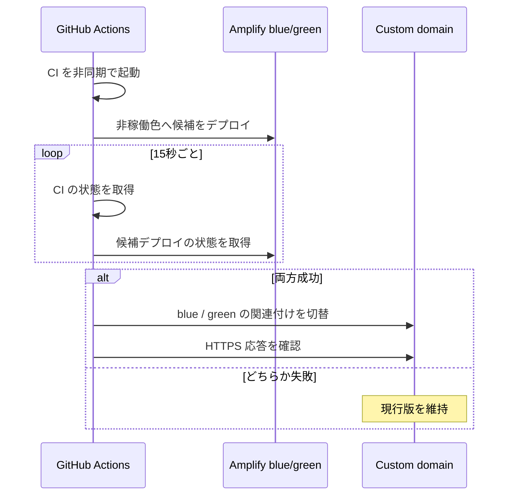

# Amplify Hosting のブルーグリーンリリース

## 目的

Amplify の Git 連携で公開ブランチを自動ビルドすると、GitHub Actions のテスト完了前に新しい画面が公開される。`frontend-blue-green.yml` は、候補を非公開の blue / green ブランチへ先にデプロイし、ローカルテストの成功後だけカスタムドメインの向き先を切り替える。

候補デプロイと CI は同時に開始する。候補が先に完了した場合、ワークフローは CI の完了状態をポーリングして待つ。CI または候補デプロイが失敗した場合、公開ドメインの関連付けは変更しない。切替後の HTTP 確認が失敗した場合は、直前の関連付けへ戻す。

## 事前設定

この方式は `amplifyapp.com` の既定URLでは切り替えられない。Amplify アプリにカスタムドメインを関連付け、公開する prefix（本番のルートなら空文字）を blue または green のどちらか一方へ設定する。

Amplify に、次の **2本の候補ブランチ** を接続する。各ブランチには公開環境と同じ `RENO_API_URL`、`COGNITO_CLIENT_ID`、`RENO_MOCK_CHAT` などの環境変数を設定する。

- `release-blue`
- `release-green`

`main`、`staging`、`dev` および候補ブランチの Amplify 自動ビルドは無効にする。候補ブランチのビルドはワークフロー中の `aws amplify start-job --job-type RELEASE` だけで起動する。これを有効のままにすると、候補への Git push がテストを待たずに別ビルドを起動し、リリースの制御が二重になる。

GitHub の `dev`、`staging`、`production` Environment に、次の値を登録する。

| 種別 | 名前 | 内容 |
| --- | --- | --- |
| Variable | `AMPLIFY_APP_ID` | 対象AmplifyアプリID |
| Variable | `AMPLIFY_DOMAIN_NAME` | 例: `example.com` |
| Variable | `AMPLIFY_DOMAIN_PREFIX` | 本番ルートは空文字、受入環境なら `staging` など |
| Variable | `AMPLIFY_BLUE_BRANCH` | 例: `release-blue` |
| Variable | `AMPLIFY_GREEN_BRANCH` | 例: `release-green` |
| Variable | `AMPLIFY_RELEASE_REPOSITORY` | Amplify接続先。例: `IFG-IP/RENO` |
| Secret | `AMPLIFY_RELEASE_TOKEN` | 上記リポジトリの候補ブランチを更新できる最小権限トークン |

既存の `AWS_ACCESS_KEY_ID` / `AWS_SECRET_ACCESS_KEY` を使う場合、AWS側の実行ユーザーには少なくとも `amplify:GetDomainAssociation`、`amplify:UpdateDomainAssociation`、`amplify:UpdateBranch`、`amplify:StartJob`、`amplify:GetJob` が必要になる。

## 実行とロールバック

第1段階では、上流の `IFLAG-hps/RENO` の `dev`、`staging`、`main` へのpushで自動実行する。候補ブランチだけは `AMPLIFY_RELEASE_REPOSITORY`（通常はAmplify接続先のfork）へ反映する。Fork側へリリース制御を移す際は、ワークフローのリポジトリガードを切り替える。手動実行時は `DEPLOY: Blue/green frontend` から環境とGit refを指定する。

CI失敗・候補ビルド失敗時は、候補が残っても公開ドメインは現行色を向いたままである。ドメイン切替後の確認に失敗した場合は、ワークフローが保存済みの関連付けへ戻す。アプリケーションコードをrevertする必要はない。
