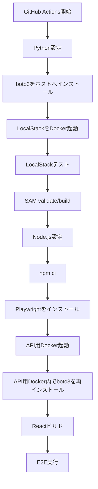
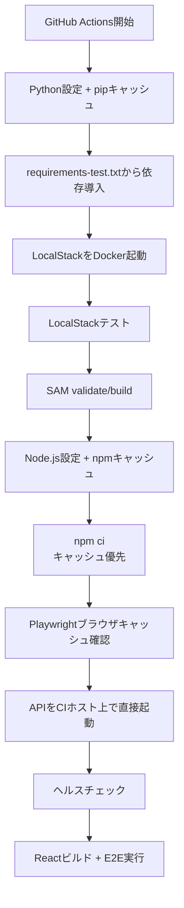

# E2Eテスト更新計画

## 1. 目的

RENOは段階導入中のため、現時点で全機能を網羅するのではなく、利用者が主要な価値を体験できる経路と、リリースを止める可能性が高い経路からE2Eテストを拡張する。

本計画では、既存テストを維持しながら、機能の成熟度に合わせてテストを段階的に追加する。

## 2. 現状

### 既存E2E

- React版と旧版のDOM一致確認
- React版と旧版のスクリーンショット一致確認
- PIN認証後のチャット送信
- チャット応答と候補表示
- PDF生成処理の基本確認

### 既存バックエンドテスト

- LocalStack上でのPIN認証
- 認証後の使用量取得

### 現状の評価

既存テストは、React移行時の表示互換性と、デモ利用の最小正常系を確認するスモークテストとしては有効である。一方、主要機能の分岐、認可、異常系、実データを伴う保存処理は十分に検証できていない。

## 3. 更新方針

1. 段階導入中は、主要導線の正常系を優先する。
2. 外部サービスに依存する処理は、E2Eでは安定したスタブを基本とし、重要なAPI連携だけをLocalStackまたは専用テスト環境で確認する。
3. UIのDOM完全一致テストは移行期間の補助とし、今後は利用者の操作結果を検証するテストを中心にする。
4. 失敗時に利用者へ表示されるエラーと、再操作可能な状態への復帰もテスト対象にする。
5. 実装済みだが未接続の機能を、E2E追加前に一覧化して解消する。

## 4. 段階別計画

### フェーズ0：現状固定（導入初期）

目的：現在のデモ導線とReact移行状態を壊さない。

実施内容：

- 既存2本のE2EをCIで継続実行する。
- Chromiumのスモークテストを必須チェックにする。
- テスト実行方法と、モックAPI利用時・実API利用時の違いを文書化する。
- テスト結果の保存先（失敗時のtrace、screenshot、video）を確認する。

完了条件：

- `npm run test:e2e` が安定して成功する。
- CI上でLocalStack、ビルド、E2Eの順序が再現できる。

### フェーズ1：主要利用導線（次の機能追加前）

目的：ユーザーがRENOの中心価値を最後まで利用できることを確認する。

追加するE2E：

1. PIN認証の正常系
2. PIN認証の不正入力・期限切れ・利用回数超過
3. チャット相談 → 写真選択（サンプル画像）→ 診断結果表示
4. 写真選択 → 施工後イメージ表示 → 昼夜切り替え
5. 費用シミュレーター → 条件変更 → 最終確認
6. 最終確認 → PDF保存 → 担当者相談フォーム表示
7. 担当者相談フォームの未入力エラーと受付完了

実装上の注意：

- 画像生成やPDFライブラリはスタブ化し、画面状態と呼び出し結果を検証する。
- サンプル画像を利用して、ファイル選択ダイアログに依存しない安定したテストにする。
- 重要な画面遷移には、表示だけでなくボタンの無効化・再表示・重複送信防止も確認する。

完了条件：

- ユーザー向け主要導線の正常系が1本の連続シナリオで成功する。
- 主要な入力エラーで、画面が操作不能にならない。

### フェーズ2：保存・再訪・管理機能

目的：保存した情報が正しいユーザー範囲で扱われることを確認する。

追加するE2E/API統合テスト：

- 事例の登録 → 一覧表示 → 部屋・スタイル検索 → 削除
- 履歴の保存 → 履歴一覧表示 → 再訪
- セッション復元、ログアウト、再ログイン
- 管理者によるゲストPIN発行 → 利用 → 一覧確認 → 削除
- ゲストユーザーが管理者機能を操作できないこと
- 画像アップロードURL発行とダウンロードURLの所有者制限

このフェーズで、フロントエンドが呼び出すAPIとバックエンドのAPI一覧を一致させる。現状では履歴表示の `get_sessions` など、呼び出し側とバックエンド側の未接続箇所を先に解消する。

完了条件：

- 保存、取得、削除、再訪の一連の動作が確認できる。
- ユーザー間のデータ混在や権限越境が検出できる。

### フェーズ3：外部認証・対応ブラウザ

目的：本番に近い認証と利用環境を確認する。

追加するテスト：

- Cognito管理者ログイン
- MFA要求時の画面遷移
- 初回ログイン時のパスワード変更
- Googleログインのリダイレクト復帰
- 認証失敗・セッション期限切れ
- モバイル相当のビューポートでの主要導線
- FirefoxまたはWebKitでの主要スモークテスト

外部認証プロバイダーをCIで直接実行することが難しい場合は、認証プロバイダーの応答を固定した契約テストを用意し、本番相当環境では別途手動または限定的な定期実行で確認する。

## 5. バックエンドテストの補強

E2Eだけに責任を持たせず、Lambdaハンドラの分岐はAPIテストで補完する。

優先して追加する項目：

- 未認証アクセスの拒否
- 無効・期限切れ・使用上限到達のPIN拒否
- チャット使用量上限とAIサービス障害
- 許可されないファイル形式の拒否
- 署名URLの所有者チェック
- 管理者限定操作の拒否
- 事例の必須項目、画像サイズ上限
- 未対応のリクエスト種別と不正JSON
- OPTIONS（CORS）応答

## 6. 優先度

| 優先度 | 対象 | 実施時期 |
| --- | --- | --- |
| P0 | 既存スモーク、PIN、チャット、主要導線 | 現フェーズ中 |
| P1 | 画像・シミュレーター・PDF・担当者相談 | 次の機能追加前 |
| P1 | APIの認可・入力検証・使用量上限 | バックエンド変更時に随時 |
| P2 | 事例・履歴・セッション復元 | 保存機能を正式提供する前 |
| P2 | 管理者PIN管理 | 管理者運用を開始する前 |
| P3 | Google/Cognito実認証、複数ブラウザ | 本番公開範囲の拡大時 |

## 7. リリース判定基準

段階導入中は、以下を満たした場合にリリース可能とする。

- P0のE2EがCIで成功する。
- 変更した機能に対応するP1テストが成功する。
- 認証・認可に関するバックエンドテストが成功する。
- 既知の未接続APIが、リリース対象の導線から呼ばれないことを確認できる。
- E2E失敗時にtraceまたはscreenshotで原因を追跡できる。

保存・管理機能を正式提供する段階では、P2までをリリース必須に引き上げる。

## 8. 最初に行う作業

1. 既存E2Eを「移行互換性」と「ユーザー導線」の2種類に分類する。
2. フェーズ1の主要導線テストを追加する。
3. `get_sessions` など、フロントエンドとバックエンドのAPI不一致を棚卸しする。
4. PIN認証、チャット、使用量、認可のバックエンドテストを拡張する。
5. CIでP0を必須化し、P1以降は機能提供タイミングに合わせて必須化する。

## 9. E2E以外のテスト計画

E2Eだけでは、細かいロジックの境界値やAPIの認可条件を効率よく検証できない。そのため、以下の3層を併用する。

### 9.1 単体テスト

目的：外部サービスやブラウザを使わず、入力と出力が明確な処理を高速に検証する。

優先対象：

- `token_for` と `subject_from_token` の正常・改ざん・期限切れ・不正形式
- `safe_filename` のパス区切り、特殊文字、長さ上限、空文字
- PINの期限・利用回数・最大利用回数の判定
- チャット履歴の件数・文字数・システムプロンプトの上限処理
- 費用シミュレーターの面積、項目、グレード別の計算
- `getPdfConversationSummary` の部屋、スタイル、予算の抽出
- フロントエンドの入力検証、候補選択、状態遷移用の純粋関数

実装方針：

- バックエンドはPython標準の`unittest`を基本とする。
- フロントエンドのロジックは、テストしやすい関数を別モジュールへ切り出し、Node.jsのテストランナーまたは導入済みのテスト基盤で検証する。
- 現在のインラインHTMLに埋め込まれたロジックは、変更が発生した箇所から段階的に切り出す。

### 9.2 API・統合テスト

目的：Lambdaハンドラ、DynamoDB、S3、SESの接続と認可を確認する。

優先対象：

- 未認証リクエストの拒否
- PINの発行、検証、期限切れ、利用上限、削除
- チャットと使用量上限
- 事例の登録、一覧、検索、削除
- セッションの保存と履歴取得
- アップロードURL・ダウンロードURLの発行と所有者制限
- 管理者限定操作の拒否
- 不正JSON、未対応`type`、不正な入力値
- AI・SESなど外部サービス障害時のエラー応答

実装方針：

- LocalStackを使った既存テストを拡張する。
- DynamoDBの実データを作成し、保存結果・取得結果・削除結果まで確認する。
- テストごとにユーザーIDを分離し、ユーザー間のデータ混在を検出する。
- 外部AIやメール送信は、実サービスを呼ばずにモックまたはスタブで確認する。

### 9.3 E2Eテスト

目的：ブラウザ上で、利用者が実際に行う主要導線が成立することを確認する。

対象は、単体・統合テストで確認しにくい画面遷移に絞る。

- PIN認証からチャット利用まで
- 写真選択、診断、施工後イメージ表示
- 費用シミュレーターから最終確認まで
- PDF保存と担当者相談フォーム
- 事例・履歴・管理者PINの代表的な画面操作
- 主要な入力エラーとAPIエラー時の復帰

DOM完全一致テストはReact移行期間の回帰確認として残すが、最終的な品質判定は、表示結果・操作結果・API呼び出し結果を検証するE2Eを中心にする。

## 10. テスト実装の優先順位

| 順序 | テスト | 実施内容 | リリース上の扱い |
| --- | --- | --- | --- |
| 1 | バックエンド単体 | トークン、PIN、入力検証、費用計算 | 直ちに必須化 |
| 2 | API・統合 | 認証、認可、使用量、保存・削除 | 対象APIの変更時に必須化 |
| 3 | 主要E2E | PIN、チャット、画像、PDF、相談 | P0として必須化 |
| 4 | フロントエンド単体 | UI状態・要約・シミュレーター | ロジック切り出し後に追加 |
| 5 | 拡張E2E | 履歴、事例、管理者、複数ブラウザ | 機能正式提供前に必須化 |

## 11. CIでの実行方針

CIでは、実行時間と失敗原因の分かりやすさを考慮して、次の順序で実行する。

1. 単体テスト
2. API・LocalStack統合テスト
3. ビルドと静的検証
4. ChromiumによるP0 E2E
5. 必要に応じて拡張E2E、別ブラウザ、モバイル相当環境

単体テストまたはAPIテストで検出できる不具合を、E2Eだけで検出する構成にはしない。E2Eが失敗した場合は、単体・統合テストのどの層で補完できるかも見直す。

## 12. 直近の追加タスク

- `backend/tests`にトークン、PIN、入力検証の単体テストを追加する。
- `test_localstack.py`に未認証、認可、事例CRUD、URL発行のテストを追加する。
- `get_sessions`など、フロントエンドが呼び出すAPIとバックエンド実装の差分を整理する。
- フロントエンドから費用計算と会話要約をテスト可能なモジュールへ切り出す。
- `package.json`に単体テスト実行コマンドを追加し、CIでE2Eより前に実行する。
- P0の単体・統合・E2Eが成功した状態を、段階導入時の最低リリース基準とする。

## 13. CIテストワークフローの簡略化

### 変更前



### 変更後



### 短縮した箇所

```text
依存関係       毎回ダウンロード
      ↓
pip/npm/Playwrightキャッシュを再利用

API起動        Python用Docker起動
      ↓
CIホスト上で直接起動

boto3          ホストとAPIコンテナで二重導入
      ↓
ホスト側で一度だけ導入
```

初回実行ではキャッシュを作成するため短縮効果は限定的だが、2回目以降は依存関係のダウンロード量とAPI起動処理が減る。テストの順序と、LocalStack・SAM・E2Eを成功条件にするガードレールは維持する。

