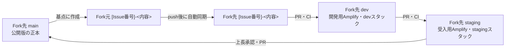

# Fork中心の環境昇格ワークフロー

## 目的

Fork元（`IFLAG-hps/RENO`）の`main`は、過去の動作デモ完成版とCI設定を保持するアーカイブとして固定する。実装、レビュー、環境昇格、公開は、Amplifyへの接続権限を持つFork先（`DaisukeShirai/RENO`）を正本として行う。

## リポジトリとブランチの役割

| リポジトリ | ブランチ | 役割 |
| --- | --- | --- |
| Fork元 | `main` | アーカイブ。今後の機能変更・PRマージは行わない |
| Fork元 | `[Issue番号]-<内容>` | Fork先`main`を基点にした実装とCI |
| Fork先 | `[Issue番号]-<内容>` | originから自動同期されるIssueブランチの読み取り専用ミラー |
| Fork先 | `dev` | 開発環境。Issueブランチを結合して開発用URLで確認 |
| Fork先 | `staging` | 上長の受入確認用環境 |
| Fork先 | `main` | 承認済みの公開環境・今後のソースコードの正本 |

Fork先の`main`が最新の公開版である。Fork元`main`へ公開内容を戻す同期は行わない。

## 標準フロー



1. Fork先の`main`をfetchし、そこを基点にFork元で`[Issue番号]-<内容>`を作成する。
2. Notionにタスク、完了条件、見積工数を登録する。
3. Fork元のIssueブランチで実装・ローカルテストを行い、Fork元へpushする。
4. Fork元へpushすると、同期WorkflowがFork先の同名Issueブランチへ反映する。Fork先のIssueブランチはミラーのため直接変更しない。
5. Fork先でIssueブランチから`dev`へのPRを作成する。CI成功後にマージすると、Amplifyの開発用URLと`reno-mvp-dev`が更新される。
6. 開発用URLで確認した変更を、Fork先の`dev`から`staging`へPRで昇格する。マージ後、Amplifyの受入用URLと`reno-mvp-staging`が更新される。
7. 上長がstaging URLで受入確認を行う。
8. 承認後、Fork先の`staging`から`main`へPRを作成してマージする。`reno-mvp-prod`と公開用Amplify URLが更新される。
9. Notionに実績工数、確認URL、リリース結果を記録する。

## Issueブランチ作成例

```bash
git fetch fork main
git switch -c 30-実装-相談セッション履歴api fork/main
git push -u origin 30-実装-相談セッション履歴api
```

## マージとデプロイの規則

- 同じ機能変更をFork先の`Issueブランチ → dev → staging → main`の順に進める。環境ごとに別実装を作らない。
- Fork先の`dev`、`staging`、`main`への直接pushは禁止し、必ずPRで昇格する。
- Issueブランチのpushでは自動テストを実行せず、Fork先へ同期する。
- Fork先のIssueブランチはFork元の内容で強制同期される。Fork先で直接コミットすると失われる。
- Fork先の`dev`、`staging`、`main`へのpushで、それぞれ`reno-mvp-dev`、`reno-mvp-staging`、`reno-mvp-prod`を自動デプロイする。
- GitHub Environmentの承認ルールを設定した場合、バックエンドデプロイは承認待ちで停止する。PR承認だけで本番公開したい場合は、`production` Environmentに追加承認を設定しない。
- Amplifyのブランチ自動ビルドとバックエンドデプロイは並行して動く。API変更は後方互換性を保つか、段階的なリリースにする。

## Phaseとの関係

Phaseは機能範囲、Fork先のブランチは環境昇格の経路である。

| フェーズ | 主な成果物 | 昇格経路 |
| --- | --- | --- |
| Phase 1：動作デモ | 現在のReact画面・既存導線 | 完了済み。Fork先`main`を基準版として維持 |
| Phase 2：MVP接続版 | S3アップロード、相談保存、受付API、SES、履歴取得 | Fork先Issueブランチ → `dev` → `staging` → `main` |
| Phase 3：本番MVP | 画像生成・ファイル保存・エラー処理・AWS結合テスト | Fork先Issueブランチ → `dev` → `staging` → `main` |

## ロールバック

- `dev`／`staging`：問題のPRをrevertし、対象ブランチへマージする。
- `main`：公開済みPRをrevertし、Fork先`main`へマージする。Amplifyと`reno-mvp-prod`が再デプロイされる。
- データ形式を破壊する変更は、先に互換性のあるスキーマ・移行処理を入れ、ロールバック手順をPRに記載する。
