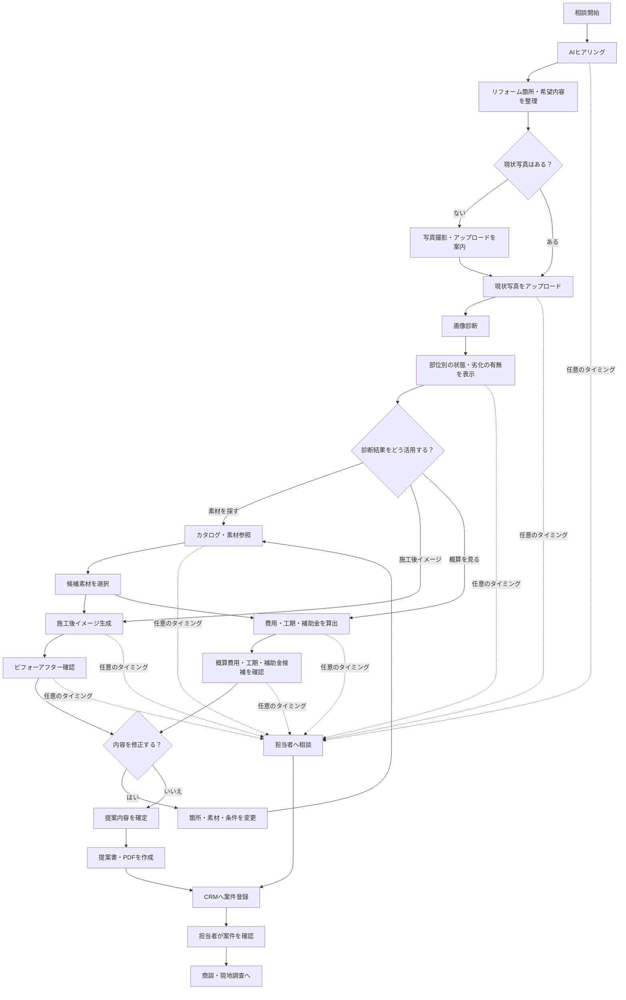

# 全体ワークフロー

## 概要

画像診断、カタログ参照、費用・工期・補助金、CRM連携を、既存のリフォーム相談フローに組み込んだ全体像です。

この図は本実装後の業務フローを示します。現在のモックでは、画像診断は固定結果、素材はサンプルデータ、工期・補助金は参考表示で、CRM登録と担当者連携は未接続です。

## フロー図



## 利用者から見たメインの流れ

```text
相談
→ 写真アップロード
→ 画像診断
→ 素材選び
→ 施工後イメージ
→ 費用・工期・補助金確認
→ 提案書作成
→ CRM登録
→ 担当者対応
```

## 設計方針

- 画像診断は写真アップロード後に案内する
- 診断結果から、素材・画像生成・概算のいずれにも進める
- 画像診断は基本導線に含めるが、ユーザーがスキップできるようにする
- 素材・診断・概算の結果は、最終的に提案内容へまとめる
- 部屋・部位の切り替えは、既存の設計・操作方法に準拠する
- 担当者への相談は、相談開始後の任意のタイミングで呼び出せるようにする
- 担当者への相談を選んだ場合は、その時点のヒアリング内容・診断結果・選択素材・概算情報をCRMへ引き継ぐ

## レビュー項目

- 画像診断をスキップできる導線が分かりやすいか
- カタログ、画像生成、概算の順番が意図どおりに伝わるか
- 既存設計に沿った部屋・部位の切り替えができるか
- 各ステップで担当者への相談を呼び出せるか
- 引き継ぎ時点の情報がCRMに十分まとまっているか
